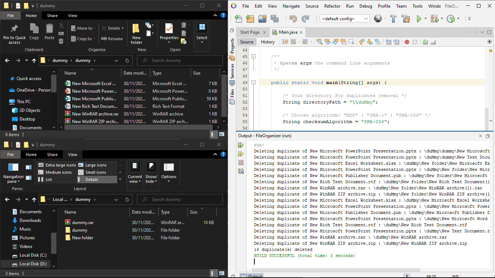
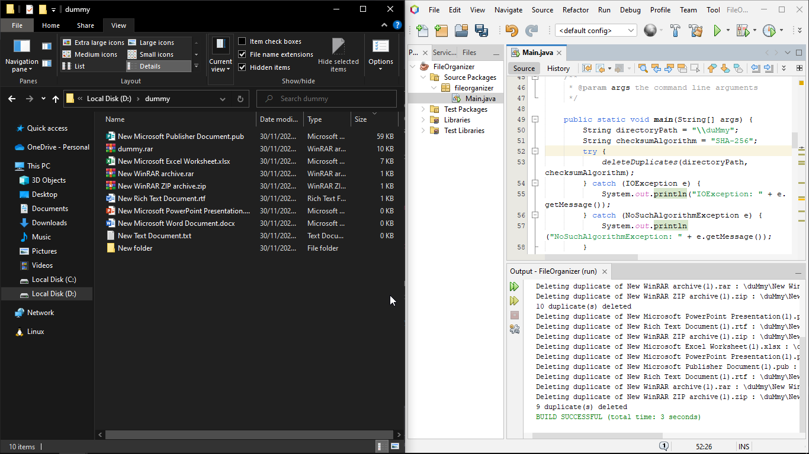
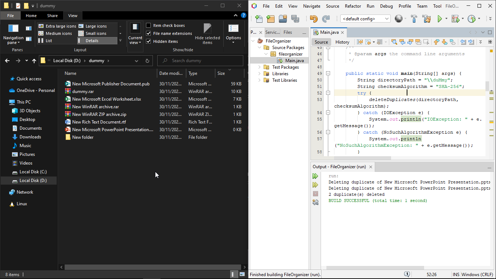
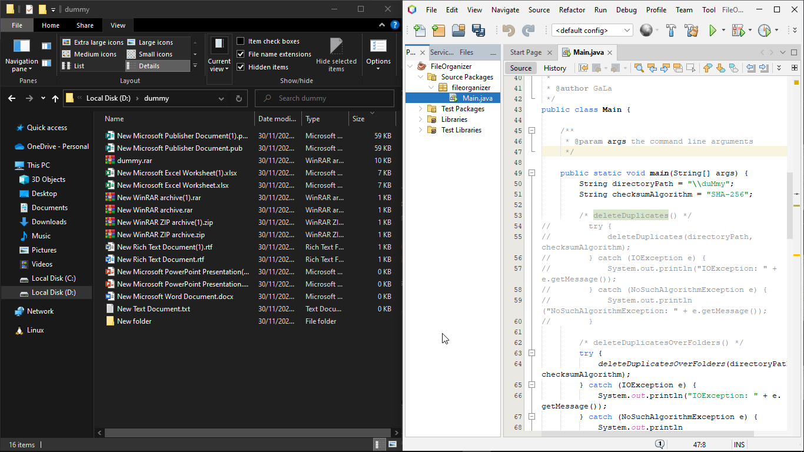
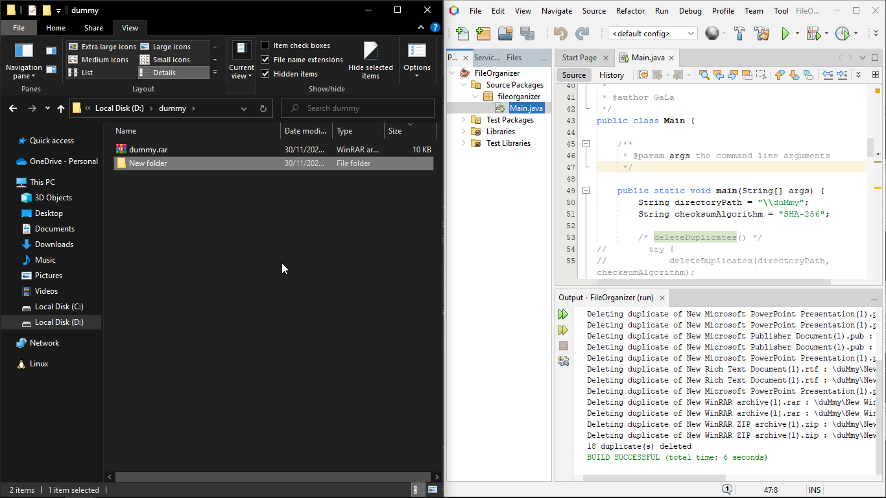

<!-- FILE ORGANIZER -->
 

  

  <h3 align="center">FileOrganizer</h3>

  

    A little project to learn object-oriented programming in Java focus on files management

<!-- TABLE OF CONTENTS -->

  
Table of Contents

  <ol>
    <li>
      <a href="#about-FileOrganizer">About FileOrganizer</a>
      <ul>
        <li><a href="#features">Features</a></li>
        <li><a href="#built-with">Built With</a></li>
      </ul>
    </li>
    <li>
      <a href="#getting-started">Getting Started</a>
      <ul>
        <li><a href="#prerequisites">Prerequisites</a></li>
        <li><a href="#installation">Installation</a></li>
      </ul>
    </li>
    <li><a href="#usage">Usage</a></li>
    <li><a href="#screenshots">Screenshots</a>
      <ul>
        <li><a href="#deleteduplicates">deleteDuplicates()</a></li>
        <li><a href="#deleteduplicatesoverfolders">deleteDuplicateOverFolders()</a></li>
      </ul>
    </li>
    <li><a href="future-development">Future Development</a></li>
    <li><a href="#license">License</a></li>
    <li><a href="#contact">Contact</a></li>
    <li><a href="#acknowledgments">Acknowledgments</a></li>
  </ol>

<!-- ABOUT FileOrganizer -->
## About FileOrganizer

FileOrganizer is a little project to learn object-oriented programming in Java focus on files management.

Its usage mainly is duplicates deletion. There are two duplicates deletion modes: one folder only & one folder and its subdirectories.

Checksum is used for duplicates comparation to any duplication files, even with different extension. Checksum availables: MD5, SHA-1, and SHA-256.

(<a href="#">back to top</a>)

### Features

FileOrganizer gives some features:
1. `deleteDuplicates()` : Duplicate deletion in one exact directory
2. `deleteDuplicatesOverFolders()` : Duplicate deletion in one directory and its subdirectories
3. Total deletion counts
4. Checksum comparator for duplication (`MD5`, `SHA-1`, `SHA-256`)
4. `IOException` : Unaccesible directory error handling
6. `NoSuchAlgorithmException` : Unknown algorithm error handling

(<a href="#">back to top</a>)

### Built With

FileOrganizer is built a standalone project using Java with Ant.

(<a href="#">back to top</a>)

<!-- GETTING STARTED -->
## Getting Started

This is an example of how to use FileOrganizer project on Apache NetBeans 19.

### Prerequisites

* Apache NetBeans 19 with JDK 17 installed

_You can find the latest version of Apache NetBeans <a href="https://netbeans.apache.org/download/index.html">here</a>._

### Installation
1. Download <a href="https://github.com/satriamjati/FileOrganizer/archive/refs/heads/main.zip">FileOrganizer</a> source code
2. Extract FileOrganizer zip to your chosen folder
1. Open Apache NetBeans 19
2. Open File > Open Project... (CTRL+Shift+O)
3. Find your folder at step 2
7. Click Open Project
8. Project ready

(<a href="#">back to top</a>)

<!-- USAGE EXAMPLES -->
## Usage

You can run FileOrganizer for duplicates deletion by:
1. Change parameter `directoryPath` to your own directory for duplicates deletion
2. Choose your duplicates deletion mode: `deleteDuplicates()` or [default] `deleteDuplicatesOverFolders()` 
3. Make sure to comment or delete method call for unused mode
4. Optional: change checksum algorithm for duplicate comparator 

You may change those parameters to observe how FileOrganizer works.

Furthermore, you can create your own modification to answer your curiousity.

(<a href="#">back to top</a>)

<!-- SCREENSHOTS -->
## Screenshots

### `deleteDuplicates()`

### before

### after

### `deleteDuplicatesOverFolders`

### root of the specified directory (before-after)

### subdirectory of the specified directory (before-after)

<!-- FUTURE DEVELOPMENT -->
## Future Development

Hopefully, find the best practices of input-output file organizer.

(<a href="#">back to top</a>)

<!-- LICENSE -->
## License

Distributed under the MIT License. See `LICENSE.txt` for more information.

(<a href="#">back to top</a>)

<!-- CONTACT -->
## Contact

Satria Manggala Jati - [@satriamjati](https://twitter.com/satriamjati) - me@jat.my.id

Project Link: [https://github.com/satriamjati/FileOrganizer](https://github.com/satriamjati/FileOrganizer)

(<a href="#">back to top</a>)

<!-- ACKNOWLEDGMENTS -->
## Acknowledgments

* <i>Matrikulasi Pemrograman Berorientasi Obyek</i> course group

(<a href="#">back to top</a>)

